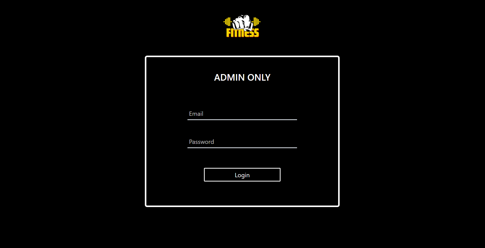
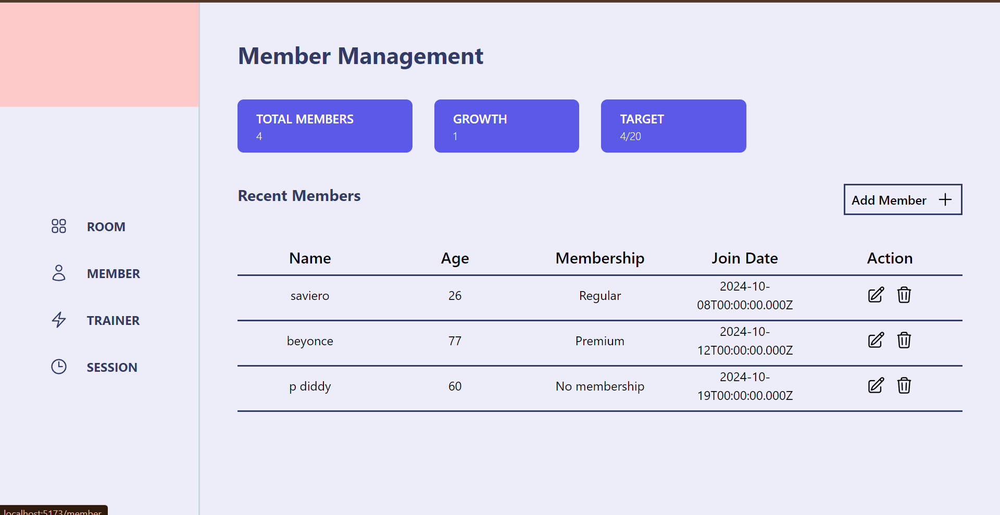
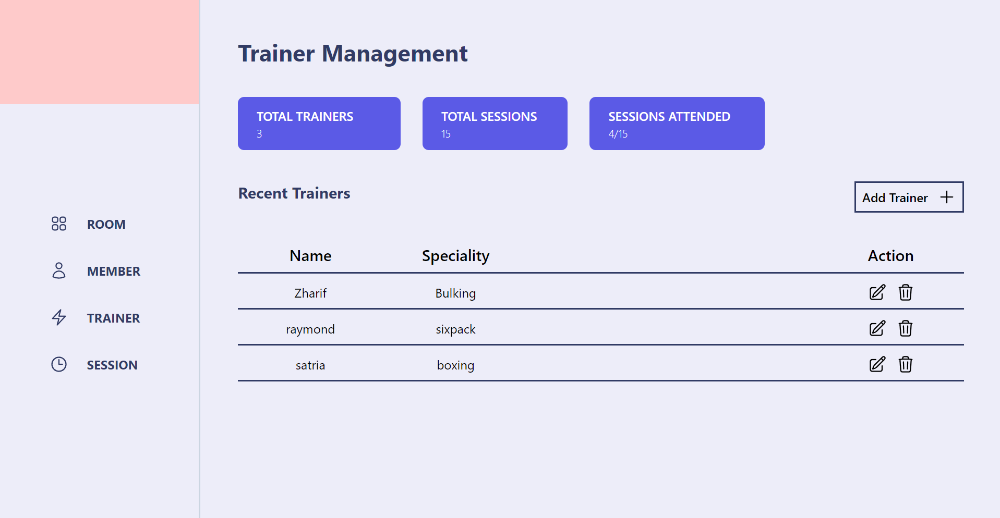

# API Management Gym
Proyek ini adalah API Management Gym yang memungkinkan pengguna untuk melakukan operasi CRUD (Create, Read, Update, Delete) untuk mengelola member gym, room, session, dan trainer. API ini dibangun menggunakan ```teknologi modern seperti Vite, Express, Sequelize, Axios, dan MySQL.```

## Fitur
- Manajemen Anggota: Tambah, lihat, perbarui, dan hapus data anggota gym.

- Manajemen Ruangan: Tambah, lihat, perbarui, dan hapus datan ruangan.

- Manajemen Sesi: Tambah, lihat, perbarui, dan hapus data sesi di gym.

- Manajemen Pelatih: Tambah, lihat, perbarui, dan hapus data pelatih gym.

## Teknologi yang Digunakan
Frontend: `Vite` untuk pengalaman pengembangan frontend yang cepat dan modern.

Backend: `Express.js` untuk menangani permintaan API.

ORM Database: `Sequelize` untuk berinteraksi dengan database MySQL.

HTTP Client: `Axios` untuk melakukan permintaan ke API.

Database: `MySQL` sebagai sistem manajemen database.

## Preview




